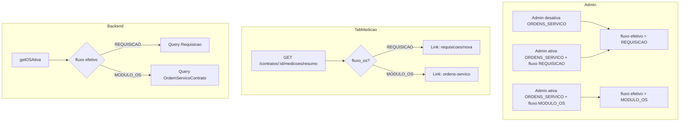

# Fluxo de OS Configurável pelo Admin

## Objetivo

Manter o módulo unificado de Ordens de Serviço, mas permitir que o admin escolha por órgão qual fluxo usar:

- **REQUISICAO**: OS criada via Requisição (tipo=ORDEM_SERVICO) em `/orgao/almoxarifado/requisicoes/nova`
- **MODULO_OS**: OS criada no módulo dedicado em `/orgao/ordens-servico`

Quando o módulo ORDENS_SERVICO está **desativado** no admin, o sistema usa sempre o fluxo REQUISICAO.

## Regras de Negócio

1. **Módulo ORDENS_SERVICO desativado** → sempre fluxo REQUISICAO (ignorar fluxo_os)
2. **Módulo ORDENS_SERVICO ativado** → usar fluxo_os do órgão (REQUISICAO ou MODULO_OS)
3. **getOSAtiva** e **listarOS** consultam a fonte correta conforme fluxo
4. **TabMedicao** (card "Nenhuma OS ativa") exibe link conforme fluxo:
  - REQUISICAO: `/orgao/almoxarifado/requisicoes/nova?contrato={id}&tipo=ORDEM_SERVICO`
  - MODULO_OS: `/orgao/ordens-servico`

## Implementação

### 1. Backend - Entity e Migration

**Arquivo:** [backend/src/orgaos/entities/orgao.entity.ts](backend/src/orgaos/entities/orgao.entity.ts)

Adicionar após `modulos_habilitados`:

```typescript
@Column({ type: 'varchar', length: 20, nullable: true, default: 'REQUISICAO' })
fluxo_os: 'REQUISICAO' | 'MODULO_OS';
```

**Migration:** Criar `AddFluxoOsOrgao` para adicionar coluna `fluxo_os` (default 'REQUISICAO').

### 2. Backend - Endpoints

**PUT /api/orgaos/:id/modulos** - Estender body para aceitar `fluxo_os`:

```json
{ "modulos": ["..."], "fluxo_os": "REQUISICAO" | "MODULO_OS" }
```

**GET /api/orgaos/me** - Incluir `fluxo_os` no retorno (já retorna dados do órgão).

**GET /api/orgaos** (admin) - Incluir `fluxo_os` na listagem para o modal.

### 3. Backend - MedicaoService

**Arquivo:** [backend/src/contratos/medicao.service.ts](backend/src/contratos/medicao.service.ts)

- Injetar `Orgao` repository ou `OrgaosService` para obter fluxo_os do órgão
- `getOSAtiva(contratoId)`: 
  1. Buscar contrato (já feito em validarContratoMedicao)
  2. Obter orgao_id do contrato → carregar orgao
  3. Determinar fluxo efetivo: se ORDENS_SERVICO não está em modulos_habilitados → REQUISICAO; senão → orgao.fluxo_os || 'REQUISICAO'
  4. Se REQUISICAO: query Requisicao (tipo=ORDEM_SERVICO, status AUTORIZADA/ORDEM_GERADA)
  5. Se MODULO_OS: query OrdemServicoContrato (status AUTORIZADA/EM_EXECUCAO)
- `listarOS(contratoId)`: mesma lógica
- **Normalizar retorno**: Requisicao usa `numero`, `descricao_os`, `data_autorizacao`, `usuario_autorizador_nome`. OrdemServicoContrato usa `numero_os`, `descricao`, `data_aprovacao`, `aprovador_nome`. Mapear para formato unificado no resumo para o frontend.

### 4. Backend - resumoMedicoes

Incluir `fluxo_os` no retorno (valor efetivo usado: REQUISICAO ou MODULO_OS) para o frontend exibir o link correto.

### 5. Admin - Modal de Módulos

**Arquivo:** [frontend/src/app/admin/modulos/page.tsx](frontend/src/app/admin/modulos/page.tsx)

- Adicionar estado `fluxoOsTemp: 'REQUISICAO' | 'MODULO_OS'`
- Quando ORDENS_SERVICO está em modulosTemp, exibir seletor/radio:
  - "Fluxo de OS: Requisição (criar via almoxarifado)" 
  - "Fluxo de OS: Módulo de Ordens de Serviço"
- Ao abrir modal: carregar fluxo_os do órgão (precisa que GET /orgaos retorne fluxo_os, ou GET /orgaos/:id inclua)
- Ao salvar: enviar fluxo_os no body do PUT modulos

### 6. Frontend - TabMedicao

**Arquivo:** [frontend/src/components/contratos/TabMedicao.tsx](frontend/src/components/contratos/TabMedicao.tsx)

No card "Nenhuma Ordem de Serviço ativa":

- Se `resumo.fluxo_os === 'REQUISICAO'`: Link para `/orgao/almoxarifado/requisicoes/nova?contrato=${contratoId}&tipo=ORDEM_SERVICO`
- Se `resumo.fluxo_os === 'MODULO_OS'`: Link para `/orgao/ordens-servico`
- Fallback (fluxo_os ausente): REQUISICAO para compatibilidade

Texto do link:

- REQUISICAO: "Clique aqui para criar uma OS na página de Requisições e liberar o cadastro de medições."
- MODULO_OS: "Clique aqui para criar uma OS no módulo de Ordens de Serviço e liberar o cadastro de medições."

### 7. Compatibilidade de Campos (os_ativa)

O frontend já trata `numero_os || numero`, `descricao || descricao_os`. Para Requisicao, garantir que o backend retorne ou que a entidade tenha:

- `data_aprovacao` ou `data_autorizacao` → frontend usa `data_aprovacao || data_autorizacao`
- `aprovador_nome` ou `usuario_autorizador_nome` → frontend usa `aprovador_nome || usuario_autorizador_nome`

A interface OSRequisicao no TabMedicao já tem campos opcionais para ambos. Verificar se Requisicao serializada inclui os nomes corretos.

## Arquivos a Modificar


| Arquivo                                          | Alteração                                                                     |
| ------------------------------------------------ | ----------------------------------------------------------------------------- |
| backend/src/orgaos/entities/orgao.entity.ts      | Campo fluxo_os                                                                |
| backend/src/migrations/                          | Nova migration AddFluxoOsOrgao                                                |
| backend/src/orgaos/orgaos.service.ts             | atualizarModulos aceitar fluxo_os; getModulosOrgao/getOrgao retornar fluxo_os |
| backend/src/orgaos/orgaos.controller.ts          | PUT modulos body; GET /me e GET / retornar fluxo_os                           |
| backend/src/contratos/medicao.service.ts         | getOSAtiva/listarOS dual-source; resumoMedicoes incluir fluxo_os              |
| frontend/src/app/admin/modulos/page.tsx          | Seletor fluxo_os quando ORDENS_SERVICO ativo                                  |
| frontend/src/components/contratos/TabMedicao.tsx | Link dinâmico conforme fluxo_os                                               |


## Fluxo de Dados




