# Diagrama ER - PORTALDCP

## Diagrama Entidade-Relacionamento

```mermaid
erDiagram
    %% ============== ENTIDADES PRINCIPAIS ==============
    ORGAO {
        uuid id PK
        string codigo UK
        string nome
        string cnpj UK
        enum tipo
        enum esfera
        string email_login UK
        string senha_hash
        array modulos_habilitados
        boolean ativo
        timestamp created_at
        timestamp updated_at
    }

    USUARIO {
        uuid id PK
        string orgao_id FK
        string nome
        string email UK
        string senha_hash
        enum role
        array modulos_habilitados
        boolean ativo
        timestamp created_at
        timestamp updated_at
    }

    FORNECEDOR {
        uuid id PK
        string cpf_cnpj UK
        string razao_social
        enum tipo_pessoa
        enum porte
        string email
        string senha
        enum nivel_atual
        enum status
        boolean nivel_i_completo
        boolean nivel_ii_completo
        boolean optante_simples
        boolean optante_mei
        string situacao_cadastral
        boolean ativo
        timestamp created_at
        timestamp updated_at
    }

    %% ============== LICITAÇÕES ==============
    LICITACAO {
        uuid id PK
        string numero_processo UK
        string numero_edital
        int ano
        int sequencial
        string orgao_id FK
        string codigo_unidade_compradora
        text objeto
        enum modalidade
        enum tipo_contratacao
        enum criterio_julgamento
        enum modo_disputa
        enum fase
        decimal valor_total_estimado
        decimal valor_homologado
        timestamp data_publicacao_edital
        timestamp data_inicio_acolhimento
        timestamp data_fim_acolhimento
        timestamp data_abertura_sessao
        string pregoeiro_id FK
        boolean tratamento_diferenciado_mpe
        string modo_beneficio_mpe
        string tipo_beneficio_mpe
        enum sigilo_orcamento
        boolean srp
        boolean enviado_pncp
        string numero_controle_pncp
        int ano_compra_pncp
        int sequencial_compra_pncp
        boolean usa_lotes
        enum modo_vinculacao_pca
        uuid item_pca_id FK
        timestamp created_at
        timestamp updated_at
    }

    LOTE {
        uuid id PK
        string licitacao_id FK
        int numero
        string descricao
        decimal valor_estimado
        uuid item_pca_id FK
        timestamp created_at
        timestamp updated_at
    }

    ITEM_LICITACAO {
        uuid id PK
        string licitacao_id FK
        string lote_id FK
        int numero
        string descricao
        decimal quantidade
        string unidade
        decimal valor_unitario_estimado
        decimal valor_total_estimado
        enum tipo_participacao
        boolean orcamento_sigiloso
        string codigo_catalogo
        uuid item_pca_id FK
        timestamp created_at
        timestamp updated_at
    }

    %% ============== PROPOSTAS ==============
    PROPOSTA {
        uuid id PK
        string licitacao_id FK
        string fornecedor_id FK
        enum status
        boolean declaracao_termos
        boolean declaracao_mpe
        boolean declaracao_integridade
        decimal valor_total_proposta
        int prazo_validade_dias
        timestamp data_envio
        timestamp created_at
        timestamp updated_at
    }

    PROPOSTA_ITEM {
        uuid id PK
        string proposta_id FK
        string item_licitacao_id FK
        string marca_modelo
        decimal valor_unitario
        decimal valor_total
        timestamp created_at
        timestamp updated_at
    }

    %% ============== SESSÃO/DISPUTA ==============
    SESSAO_DISPUTA {
        uuid id PK
        string licitacao_id FK
        enum status
        timestamp data_abertura
        timestamp data_encerramento
        int tempo_restante_segundos
        string item_atual_id
        timestamp created_at
        timestamp updated_at
    }

    LANCE {
        uuid id PK
        string sessao_id FK
        string fornecedor_id FK
        string item_licitacao_id FK
        decimal valor
        decimal percentual_desconto
        int rodada
        timestamp created_at
    }

    %% ============== CONTRATOS ==============
    CONTRATO {
        uuid id PK
        string orgao_id FK
        string licitacao_id FK
        string fornecedor_id FK
        string numero_contrato
        int ano
        enum tipo
        enum status
        text objeto
        decimal valor_inicial
        decimal valor_global
        date data_assinatura
        date data_vigencia_inicio
        date data_vigencia_fim
        string fiscal_id
        string gestor_id
        boolean enviado_pncp
        timestamp created_at
        timestamp updated_at
    }

    ITEM_CONTRATO {
        uuid id PK
        string contrato_id FK
        string item_licitacao_id FK
        string descricao
        decimal quantidade_total
        decimal quantidade_empenhada
        decimal quantidade_entregue
        decimal valor_unitario
        timestamp created_at
        timestamp updated_at
    }

    %% ============== ALMOXARIFADO ==============
    REQUISICAO {
        uuid id PK
        string orgao_id FK
        string contrato_id FK
        string numero
        int ano
        enum status
        enum tipo
        enum prioridade
        string setor_solicitante
        text justificativa
        string usuario_solicitante_id
        string usuario_autorizador_id
        timestamp data_autorizacao
        decimal valor_total_estimado
        boolean saldo_reservado
        string ordem_fornecimento_id FK
        timestamp created_at
        timestamp updated_at
    }

    ITEM_REQUISICAO {
        uuid id PK
        string requisicao_id FK
        string item_contrato_id FK
        decimal quantidade
        decimal valor_unitario
        decimal valor_total
        timestamp created_at
        timestamp updated_at
    }

    ORDEM_FORNECIMENTO {
        uuid id PK
        string requisicao_id FK
        string contrato_id FK
        string fornecedor_id FK
        string numero
        enum status
        date data_emissao
        date data_prevista_entrega
        timestamp data_ciencia_recebimento
        timestamp data_ciencia_entrega
        string arquivo_pdf
        decimal valor_total
        timestamp created_at
        timestamp updated_at
    }

    %% ============== PCA ==============
    PCA {
        uuid id PK
        string orgao_id FK
        int ano
        string codigo_unidade
        boolean enviado_pncp
        string numero_controle_pncp
        timestamp created_at
        timestamp updated_at
    }

    ITEM_PCA {
        uuid id PK
        string pca_id FK
        int numero
        string descricao
        decimal valor_estimado
        string codigo_classe
        string nome_classe
        timestamp created_at
        timestamp updated_at
    }

    %% ============== RELACIONAMENTOS ==============
    ORGAO ||--o{ USUARIO : possui
    ORGAO ||--o{ LICITACAO : realiza
    ORGAO ||--o{ CONTRATO : possui
    ORGAO ||--o{ REQUISICAO : recebe
    ORGAO ||--o{ PCA : possui

    LICITACAO ||--o{ LOTE : contem
    LICITACAO ||--o{ ITEM_LICITACAO : possui
    LICITACAO ||--o{ PROPOSTA : recebe
    LICITACAO ||--o{ SESSAO_DISPUTA : tem
    LICITACAO ||--o{ CONTRATO : gera

    LOTE ||--o{ ITEM_LICITACAO : agrupa

    FORNECEDOR ||--o{ PROPOSTA : envia
    FORNECEDOR ||--o{ CONTRATO : contratado
    FORNECEDOR ||--o{ ORDEM_FORNECIMENTO : atende

    PROPOSTA ||--o{ PROPOSTA_ITEM : contem

    SESSAO_DISPUTA ||--o{ LANCE : registra

    CONTRATO ||--o{ ITEM_CONTRATO : possui
    CONTRATO ||--o{ REQUISICAO : atende

    REQUISICAO ||--o{ ITEM_REQUISICAO : contem
    REQUISICAO ||--o{ ORDEM_FORNECIMENTO : gera

    PCA ||--o{ ITEM_PCA : contem
    ITEM_PCA ||--o{ LICITACAO : vincula
    ITEM_PCA ||--o{ LOTE : vincula
    ITEM_PCA ||--o{ ITEM_LICITACAO : vincula

    USUARIO ||--o{ LICITACAO : pregoeiro
```

## Legenda

| Símbolo | Significado |
|---------|-------------|
| `||--o{` | Um para muitos (1:N) |
| `||--||` | Um para um (1:1) |
| PK | Primary Key |
| FK | Foreign Key |
| UK | Unique Key |

## Cores por Domínio (no Mermaid)

- **Azul**: Entidades Core (Órgão, Licitação)
- **Verde**: Fornecedores e Propostas
- **Laranja**: Contratos e Almxoarifado
- **Roxo**: PCA e Itens
- **Vermelho**: Sessão e Lances
