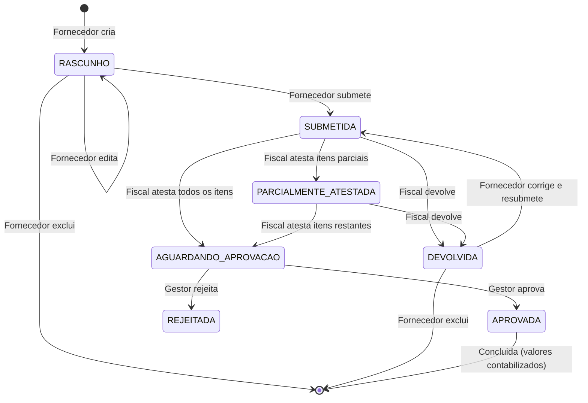

# Fluxo de Medicao - Portal DCP

## Visao Geral

O modulo de medicao permite o controle de execucao fisica e financeira de contratos com modalidade **MEDICAO** (tipicamente obras e servicos de engenharia). O fluxo envolve tres atores principais: **Fornecedor**, **Fiscal** e **Gestor/Aprovador**.

---

## Diagrama de Status

---

## Etapas do Fluxo

### 1. Cadastro do Cronograma (Orgao)

- O orgao cadastra **etapas do cronograma** no contrato (ex: Fundacao, Alvenaria, Cobertura)
- Cada etapa possui:
  - Descricao
  - Percentual fisico previsto (%)
  - Valor previsto (R$)
  - Data inicio e fim previstas
- **Validacao**: soma dos valores das etapas nao pode ultrapassar o valor global do contrato
- **Validacao**: soma dos percentuais fisicos nao pode ultrapassar 100%
- Auto-calculo: ao informar percentual, calcula valor automaticamente (e vice-versa)

### 2. Criacao da Medicao (Fornecedor ou Orgao)

- **Fornecedor** cria a medicao informando:
  - Periodo (data inicio e fim)
  - Para cada etapa do cronograma: percentual executado e/ou valor medido
  - Observacoes
  - Nota fiscal (numero, valor, data) - opcional na criacao
- **Status inicial**: `RASCUNHO`
- Fornecedor pode editar, adicionar fotos/documentos e excluir enquanto em `RASCUNHO`

### 3. Anexos (Fotos e Documentos)

- Fornecedor pode enviar fotos e documentos nos status: `RASCUNHO`, `DEVOLVIDA`, `PARCIALMENTE_ATESTADA`
- Cada anexo pode ter um titulo/descricao para facilitar identificacao pelo fiscal
- Tipos permitidos: PDF, JPEG, PNG (max 10MB)
- Validacao de seguranca: MIME type, extensao, magic bytes
- Fornecedor pode excluir anexos nos mesmos status acima
- Orgao pode excluir anexos a qualquer momento (com dupla confirmacao)

### 4. Submissao (Fornecedor)

- Fornecedor clica em "Enviar para Ateste"
- **Status**: `RASCUNHO` ou `DEVOLVIDA` -> `SUBMETIDA`
- **Notificacao**: usuarios do orgao sao notificados
- Fornecedor nao pode mais editar ou excluir a medicao

### 5. Ateste do Fiscal (Orgao)

O fiscal pode:

#### a) Atestar Todos os Itens
- Verifica in loco, confere documentos e fotos
- Marca todos os itens como atestados
- **Status**: `SUBMETIDA` -> `AGUARDANDO_APROVACAO`
- **Notificacao**: gestores/aprovadores sao notificados
- Mensagem ao fiscal: "Medicao atestada com sucesso! Foi enviada para aprovacao do gestor na Central de Aprovacoes."

#### b) Ateste Parcial
- Fiscal seleciona apenas os itens que estao conformes
- Itens nao selecionados ficam pendentes
- **Status**: `SUBMETIDA` -> `PARCIALMENTE_ATESTADA`
- **Notificacao**: fornecedor e notificado sobre os itens devolvidos
- Fornecedor pode ajustar os itens nao atestados e resubmeter

#### c) Devolver
- Fiscal devolve toda a medicao com um motivo
- **Status**: `SUBMETIDA` ou `PARCIALMENTE_ATESTADA` -> `DEVOLVIDA`
- **Notificacao**: fornecedor e notificado com o motivo
- Fornecedor pode editar e resubmeter

### 6. Aprovacao do Gestor (Central de Aprovacoes)

O gestor vê medicoes com status `AGUARDANDO_APROVACAO` na **Central de Aprovacoes** (`/orgao/aprovacoes`).

#### a) Aprovar
- **Status**: `AGUARDANDO_APROVACAO` -> `APROVADA`
- Etapas do cronograma sao atualizadas com valores executados
- Etapas com 100% de execucao sao marcadas como `CONCLUIDA`
- **Notificacao**: fiscal e fornecedor sao notificados

#### b) Rejeitar
- **Status**: `AGUARDANDO_APROVACAO` -> `REJEITADA`
- Gestor deve informar motivo
- **Notificacao**: fiscal e fornecedor sao notificados com motivo

---

## Permissoes

| Acao | Fornecedor | Fiscal (Orgao) | Gestor/Aprovador | Admin (pode_excluir_medicao) |
|---|---|---|---|---|
| Criar medicao | Sim | Sim | - | - |
| Editar rascunho | Sim | Sim | - | - |
| Submeter para ateste | Sim | - | - | - |
| Atestar (total/parcial) | - | Sim | - | - |
| Devolver para fornecedor | - | Sim | - | - |
| Aprovar medicao | - | - | Sim | - |
| Rejeitar medicao | - | - | Sim | - |
| Excluir rascunho | Sim | Sim | - | - |
| Excluir devolvida | Sim | Sim | - | - |
| Excluir aprovada | - | - | - | Sim |
| Enviar anexos | RASCUNHO/DEVOLVIDA/PARCIAL | - | - | - |
| Excluir anexos (fornecedor) | RASCUNHO/DEVOLVIDA/PARCIAL | - | - | - |
| Excluir anexos (orgao) | - | Qualquer status | Qualquer status | Qualquer status |

---

## Notificacoes

| Evento | Destinatarios | Tipo |
|---|---|---|
| Medicao submetida | Usuarios do orgao | `MEDICAO_SUBMETIDA` |
| Medicao atestada (completa) | Gestores/aprovadores | `MEDICAO_ATESTADA` |
| Medicao parcialmente atestada | Fornecedor | `MEDICAO_PARCIALMENTE_ATESTADA` |
| Medicao aprovada | Fiscal + fornecedor | `MEDICAO_APROVADA` |
| Medicao rejeitada | Fiscal + fornecedor | `MEDICAO_REJEITADA` |
| Medicao devolvida | Fornecedor | `MEDICAO_DEVOLVIDA` |

---

## Endpoints da API

### Etapas do Cronograma

| Metodo | Rota | Descricao |
|---|---|---|
| POST | `/api/contratos/:contratoId/etapas` | Criar etapa |
| GET | `/api/contratos/:contratoId/etapas` | Listar etapas |
| PUT | `/api/contratos/etapas/:etapaId` | Atualizar etapa |
| DELETE | `/api/contratos/etapas/:etapaId` | Excluir etapa |

### Medicoes (Orgao)

| Metodo | Rota | Descricao |
|---|---|---|
| POST | `/api/contratos/:contratoId/medicoes` | Criar medicao |
| GET | `/api/contratos/:contratoId/medicoes` | Listar medicoes do contrato |
| GET | `/api/contratos/medicoes/:medicaoId` | Buscar medicao por ID |
| PATCH | `/api/contratos/medicoes/:medicaoId/atestar` | Atestar todos os itens |
| PATCH | `/api/contratos/medicoes/:medicaoId/atestar-itens` | Atestar itens parciais |
| PATCH | `/api/contratos/medicoes/:medicaoId/devolver` | Devolver ao fornecedor |
| PATCH | `/api/contratos/medicoes/:medicaoId/aprovar` | Aprovar medicao |
| PATCH | `/api/contratos/medicoes/:medicaoId/rejeitar` | Rejeitar medicao |
| DELETE | `/api/contratos/medicoes/:medicaoId` | Excluir medicao |
| GET | `/api/contratos/medicoes/pendentes-ateste?orgaoId=` | Listar pendentes de ateste |
| GET | `/api/contratos/medicoes/pendentes-aprovacao?orgaoId=` | Listar pendentes de aprovacao |
| GET | `/api/contratos/medicoes/resumo-fiscal?orgaoId=` | Resumo fiscal por contrato |

### Medicoes (Fornecedor)

| Metodo | Rota | Descricao |
|---|---|---|
| GET | `/api/fornecedor/contratos/:contratoId/medicoes` | Listar medicoes do fornecedor |
| POST | `/api/fornecedor/contratos/:contratoId/medicoes` | Criar medicao |
| PATCH | `/api/fornecedor/contratos/medicoes/:medicaoId/submeter` | Submeter para ateste |
| DELETE | `/api/fornecedor/contratos/medicoes/:medicaoId` | Excluir rascunho/devolvida |

### Anexos

| Metodo | Rota | Descricao |
|---|---|---|
| POST | `/api/fornecedor/contratos/medicoes/:medicaoId/anexos` | Upload de anexo (fornecedor) |
| GET | `/api/fornecedor/contratos/medicoes/:medicaoId/anexos` | Listar anexos (fornecedor) |
| DELETE | `/api/fornecedor/contratos/medicoes/anexos/:anexoId` | Excluir anexo (fornecedor) |
| GET | `/api/contratos/medicoes/:medicaoId/anexos` | Listar anexos (orgao) |
| DELETE | `/api/contratos/medicoes/anexos/:anexoId` | Excluir anexo (orgao) |

---

## Paginas do Frontend

| Pagina | Rota | Descricao |
|---|---|---|
| Contratos do Fornecedor | `/fornecedor/contratos/[id]` | Criar/submeter medicoes, enviar anexos |
| Contrato do Orgao | `/orgao/contratos/[id]` | Tab Medicao - atestar, devolver, gerenciar |
| Painel de Medicoes | `/orgao/medicoes` | Visao consolidada de todos os contratos com medicao |
| Central de Aprovacoes | `/orgao/aprovacoes` | Aprovar/rejeitar medicoes (aba Medicoes) |

---

## Regras de Negocio

1. **Valor da medicao** nao pode exceder o saldo disponivel do contrato (valor global - soma de medicoes aprovadas)
2. **Percentual fisico** de cada item nao pode exceder o percentual previsto na etapa
3. **Soma das etapas** do cronograma nao pode ultrapassar o valor global do contrato
4. **Soma dos percentuais** das etapas nao pode ultrapassar 100%
5. Ao **aprovar** uma medicao, os valores sao contabilizados nas etapas e no contrato
6. Ao **excluir** uma medicao aprovada (admin), os valores executados nas etapas sao revertidos
7. **Datas** sao exibidas no formato brasileiro (DD/MM/AAAA) e tratadas para evitar problemas de timezone
8. **Arquivos** sao armazenados em `/data/uploads/medicoes/{medicaoId}/` (volume persistente no Railway)
