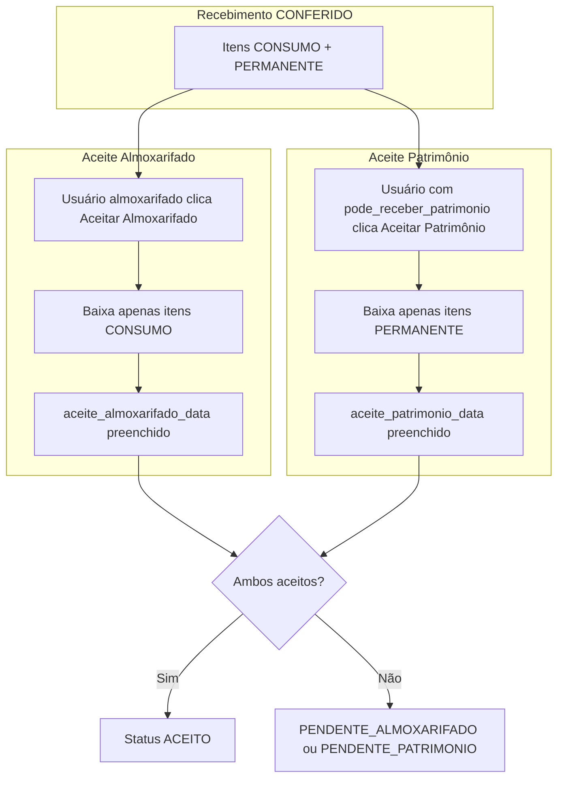

# Aceite separado Almoxarifado / Patrimônio — Plano adaptado ao sistema

> Adaptação do plano em `aceite_separado_almoxarifado_patrimônio_plan.md` para a estrutura atual do Portal DCP.

---

## Diferenças entre o plano original e o sistema atual

| Aspecto | Plano original | Sistema atual |
|--------|----------------|---------------|
| Itens do recebimento | Tabela `recebimento_item` | JSONB `recebimento.itens` |
| Fluxo de entrada | Wizard 3 etapas (NF → Vincular → Recebimento) | Modal "Registrar Recebimento" em ordens + lista em recebimentos |
| Vincular Produtos (IA) | Tabela `recebimento_item_vinculo` | Não existe — itens vêm da OF |
| Log de eventos | Tabela `recebimento_log` | `recebimento.ocorrencias` (JSONB) |

---

## Estratégia de adaptação

1. **Manter estrutura atual**: usar `recebimento.itens` (JSONB) e estender o schema por item.
2. **Não criar novas tabelas** na Fase 1: `recebimento_item`, `recebimento_log`, `recebimento_item_vinculo` ficam para fases futuras.
3. **Implementar em fases** para reduzir risco e permitir entregas incrementais.

---

## Fase 1 — Aceite separado (core)

### 1.1 Modelo de dados

**Arquivo:** [backend/src/almoxarifado/entities/recebimento.entity.ts](backend/src/almoxarifado/entities/recebimento.entity.ts)

Adicionar colunas:

```typescript
// Aceite Almoxarifado (itens CONSUMO)
@Column({ type: 'timestamp', nullable: true })
aceite_almoxarifado_data: Date | null;

@Column({ type: 'varchar', nullable: true })
aceite_almoxarifado_usuario_id: string | null;

@Column({ type: 'varchar', nullable: true })
aceite_almoxarifado_usuario_nome: string | null;

// Aceite Patrimônio (itens PERMANENTE)
@Column({ type: 'timestamp', nullable: true })
aceite_patrimonio_data: Date | null;

@Column({ type: 'varchar', nullable: true })
aceite_patrimonio_usuario_id: string | null;

@Column({ type: 'varchar', nullable: true })
aceite_patrimonio_usuario_nome: string | null;
```

**Status:** adicionar ao enum `StatusRecebimento`:

```typescript
PENDENTE_ALMOXARIFADO = 'PENDENTE_ALMOXARIFADO',  // Patrimônio aceitou; falta almoxarifado
PENDENTE_PATRIMONIO = 'PENDENTE_PATRIMONIO',      // Almoxarifado aceitou; falta patrimônio
```

**Função auxiliar** (no service ou como método):

```typescript
calcularStatus(recebimento: Recebimento): StatusRecebimento {
  const temConsumo = recebimento.itens?.some(i => i.tipo_item === 'CONSUMO');
  const temPermanente = recebimento.itens?.some(i => i.tipo_item === 'PERMANENTE');
  const almoxAceito = !temConsumo || !!recebimento.aceite_almoxarifado_data;
  const patrimAceito = !temPermanente || !!recebimento.aceite_patrimonio_data;

  if (almoxAceito && patrimAceito) return StatusRecebimento.ACEITO;
  if (!almoxAceito && !patrimAceito) return StatusRecebimento.CONFERIDO;
  if (!almoxAceito) return StatusRecebimento.PENDENTE_ALMOXARIFADO;
  return StatusRecebimento.PENDENTE_PATRIMONIO;
}
```

### 1.2 Backend — Novos endpoints

**Arquivo:** [backend/src/almoxarifado/almoxarifado.controller.ts](backend/src/almoxarifado/almoxarifado.controller.ts)

| Endpoint | Método | Permissão | Ação |
|----------|--------|-----------|------|
| `/recebimentos/:id/aceitar-almoxarifado` | POST | Acesso almoxarifado | Aceita itens CONSUMO, dá baixa |
| `/recebimentos/:id/aceitar-patrimonio` | POST | `pode_receber_patrimonio` | Aceita itens PERMANENTE, dá baixa |

**Deprecar:** o endpoint atual `POST /recebimentos/:id/aceitar` pode ser mantido temporariamente para compatibilidade, mas redirecionar para os novos quando houver itens mistos.

### 1.3 Lógica de aceite

**Arquivo:** [backend/src/almoxarifado/recebimento.service.ts](backend/src/almoxarifado/recebimento.service.ts)

- **`aceitarAlmoxarifado(id, usuarioId, usuarioNome)`**
  - Só se existir item CONSUMO e `aceite_almoxarifado_data` for null
  - Para cada item com `tipo_item === 'CONSUMO'`: baixa no contrato, `quantidade_aceita`, `atualizarAtendimento`
  - Preenche `aceite_almoxarifado_*`
  - Define `status` e `baixa_realizada` conforme `calcularStatus()`

- **`aceitarPatrimonio(id, usuarioId, usuarioNome)`**
  - Exige `pode_receber_patrimonio`
  - Mesma lógica para itens PERMANENTE

- **Regras especiais:**
  - Recebimento só CONSUMO: um aceite almoxarifado conclui
  - Recebimento só PERMANENTE: um aceite patrimônio conclui
  - Recebimento misto: ambos precisam aceitar

### 1.4 Estorno

- Estorno total permitido apenas quando `status === ACEITO`
- Ao estornar: reverter baixa de todos os itens, limpar `aceite_almoxarifado_*` e `aceite_patrimonio_*`

### 1.5 Frontend

**Arquivo:** [frontend/src/app/orgao/almoxarifado/recebimentos/page.tsx](frontend/src/app/orgao/almoxarifado/recebimentos/page.tsx)

- **Botões de ação na lista:**
  - "Aceitar Almoxarifado" — visível se houver CONSUMO e `aceite_almoxarifado_data` null
  - "Aceitar Patrimônio" — visível se houver PERMANENTE e `aceite_patrimonio_data` null, e usuário tiver `pode_receber_patrimonio`

- **Modal de detalhes:**
  - Agrupar itens em "Almoxarifado (Consumo)" e "Patrimônio (Permanente)"
  - Mostrar status por grupo: "Aceito em DD/MM/AAAA por Nome" ou "Pendente"

- **Labels de status:**
  - `PENDENTE_ALMOXARIFADO` → "Pendente aceite almoxarifado"
  - `PENDENTE_PATRIMONIO` → "Pendente aceite patrimônio"

### 1.6 Migration

Criar migration para as 6 novas colunas em `recebimentos`.

### 1.7 Compatibilidade

- Recebimentos antigos com `baixa_realizada = true` e campos de aceite null: tratar como ACEITO
- Recebimentos antigos sem `tipo_item` nos itens: considerar todos como CONSUMO

---

## Fase 2 — Situação por item (RECEBER / PARCIAL / RECUSAR)

### 2.1 Extensão do schema JSONB

**Arquivo:** [backend/src/almoxarifado/entities/recebimento.entity.ts](backend/src/almoxarifado/entities/recebimento.entity.ts)

Estender o tipo de `itens`:

```typescript
itens: {
  item_contrato_id: string;
  numero_item: number;
  descricao: string;
  unidade_medida: string;
  tipo_item?: string;
  quantidade_esperada: number;
  quantidade_recebida: number;
  quantidade_aceita: number;
  situacao?: 'PENDENTE' | 'RECEBER' | 'PARCIAL' | 'RECUSAR';  // novo
  motivo_recusa?: string | null;                                 // novo
  observacao?: string;
  valor_unitario: number;
  valor_total: number;
}[];
```

### 2.2 Regras

- `RECEBER`: aceita `quantidade_recebida` integral
- `PARCIAL`: aceita `quantidade_recebida` < qtd NF; saldo em aberto na OF
- `RECUSAR`: `motivo_recusa` obrigatório; dispara devolução integral da NF (status `DEVOLVIDO`)

### 2.3 DTOs

**Arquivo:** [backend/src/almoxarifado/dto/ordem-fornecimento.dto.ts](backend/src/almoxarifado/dto/ordem-fornecimento.dto.ts)

```typescript
export class AceitarAlmoxarifadoDto {
  itens: { item_contrato_id: string; situacao: string; quantidade_recebida?: number; motivo_recusa?: string; observacao?: string }[];
  observacoes?: string;
}
```

### 2.4 Frontend

- Por item: checkboxes/botões "Total", "Parcial", "Recusar"
- Parcial: campo numérico `quantidade_receber`
- Recusar: select de motivo + textarea
- Qualquer recusa → modal de confirmação "Devolução integral da NF"

---

## Fase 3 — Fluxo visual completo (wizard 3 etapas)

> As imagens mostram: Ordens Aguardando Recebimento → 1. Nota Fiscal → 2. Vincular Produtos → 3. Recebimento.

Esta fase exige:

1. **Nova rota** (ex.: `/orgao/almoxarifado/recebimentos/of/[ordemId]`) com stepper de 3 etapas
2. **Etapa 1 — Nota Fiscal:** dados da NF + upload/importação de XML
3. **Etapa 2 — Vincular Produtos:** tabela NF ↔ sistema, com IA (quando disponível) ou vínculo manual
4. **Etapa 3 — Recebimento:** blocos Almoxarifado e Patrimônio, ações por item

Ou integrar esse fluxo na tela de ordens, substituindo o modal "Registrar Recebimento" por um wizard em página.

---

## Fase 4 — Recursos avançados (futuro)

- Tabela `recebimento_log` para auditoria
- Estorno parcial por grupo (`estornar-almoxarifado`, `estornar-patrimonio`)
- Importação de XML e matching IA
- Bloqueio de edição da OF quando houver aceite parcial/total

---

## Resumo de arquivos por fase

### Fase 1

| Arquivo | Alteração |
|---------|-----------|
| `recebimento.entity.ts` | Campos aceite almox/patrimônio; novos status |
| Migration | 6 colunas novas |
| `recebimento.service.ts` | `aceitarAlmoxarifado`, `aceitarPatrimonio`, `calcularStatus` |
| `almoxarifado.controller.ts` | 2 novos endpoints |
| `recebimentos/page.tsx` | Botões separados, agrupamento de itens, labels de status |

### Fase 2

| Arquivo | Alteração |
|---------|-----------|
| `recebimento.entity.ts` | Extensão do schema `itens` (situacao, motivo_recusa) |
| `ordem-fornecimento.dto.ts` | DTOs para aceite com situação por item |
| `recebimento.service.ts` | Validação situacao, devolverNF |
| `recebimentos/page.tsx` | Ações por item, modal recusa |

### Fase 3

| Arquivo | Alteração |
|---------|-----------|
| Nova página ou ordens | Wizard 3 etapas |
| Backend | Endpoints importar XML, confirmar vínculos (se IA) |

---

## Fluxo visual (Fase 1)


