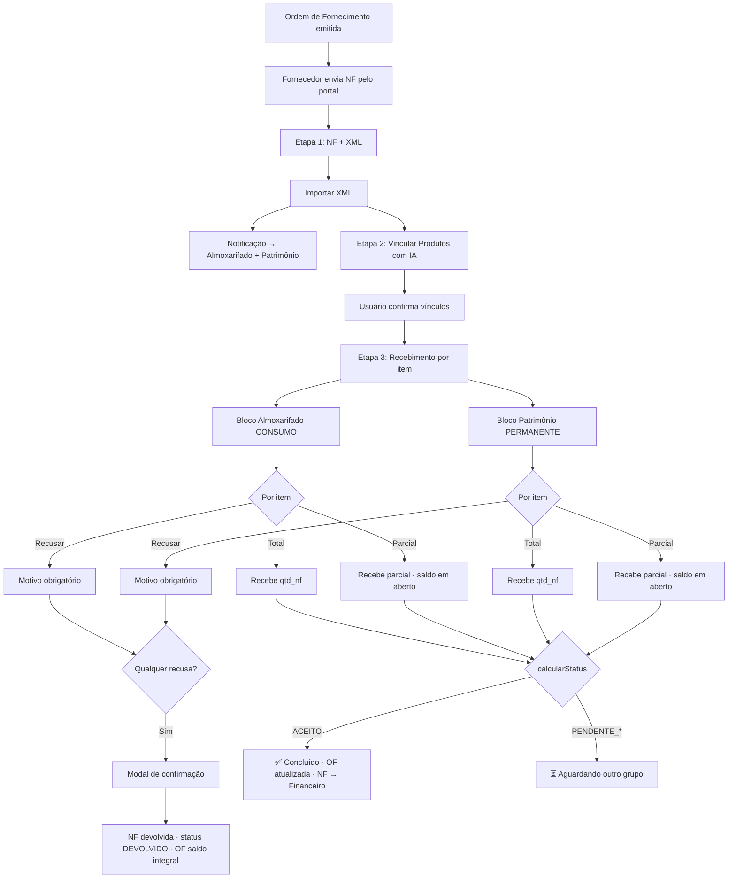

# Aceite separado Almoxarifado / Patrimônio

## Contexto atual

- **Item**: `tipo_item` = CONSUMO (almoxarifado) ou PERMANENTE (patrimônio)
- **Recebimento**: aceite único; se houver qualquer item PERMANENTE, exige `pode_receber_patrimonio`
- **Baixa**: feita em bloco para todos os itens no aceite

## Objetivo

- Almoxarifado aceita apenas itens CONSUMO e dá baixa só neles
- Patrimônio aceita apenas itens PERMANENTE e dá baixa só neles
- Recebimento totalmente aceito quando ambos os grupos forem aceitos (quando existirem)
- Recebimento parcial por item, com saldo mantido em aberto na OF
- Recusa por item com motivo obrigatório; qualquer recusa devolve a NF integralmente
- Estorno parcial permitido por grupo
- Auditoria completa via log de eventos
- Fluxo completo em tela única: Lista → NF/XML → Vincular Produtos (IA) → Recebimento

---

## 1. Modelo de dados (Recebimento)

Adicionar em [backend/src/almoxarifado/entities/recebimento.entity.ts](backend/src/almoxarifado/entities/recebimento.entity.ts):

```typescript
// Aceite Almoxarifado (itens CONSUMO)
aceite_almoxarifado_data: Date | null;
aceite_almoxarifado_usuario_id: string | null;
aceite_almoxarifado_usuario_nome: string | null;

// Aceite Patrimônio (itens PERMANENTE)
aceite_patrimonio_data: Date | null;
aceite_patrimonio_usuario_id: string | null;
aceite_patrimonio_usuario_nome: string | null;
```

### Status derivado via `calcularStatus()`

```typescript
calcularStatus(recebimento): StatusRecebimento {
  const temConsumo    = recebimento.itens.some(i => i.tipo_item === 'CONSUMO');
  const temPermanente = recebimento.itens.some(i => i.tipo_item === 'PERMANENTE');
  const almoxAceito   = !temConsumo    || !!recebimento.aceite_almoxarifado_data;
  const patrimAceito  = !temPermanente || !!recebimento.aceite_patrimonio_data;

  if (almoxAceito && patrimAceito)   return 'ACEITO';
  if (!almoxAceito && !patrimAceito) return 'CONFERIDO';
  if (!almoxAceito)                  return 'PENDENTE_ALMOXARIFADO';
  return 'PENDENTE_PATRIMONIO';
}
```

| Status                  | Descrição                                       |
| ----------------------- | ----------------------------------------------- |
| `CONFERIDO`             | Nenhum aceite realizado ainda                   |
| `PENDENTE_ALMOXARIFADO` | Patrimônio já aceitou; aguardando almoxarifado  |
| `PENDENTE_PATRIMONIO`   | Almoxarifado já aceitou; aguardando patrimônio  |
| `ACEITO`                | Todos os grupos aceitos — recebimento concluído |
| `DEVOLVIDO`             | NF devolvida integralmente ao fornecedor        |

---

## 2. Modelo de dados (Item de Recebimento)

Adicionar em `recebimento_item.entity.ts`:

```typescript
situacao: 'PENDENTE' | 'RECEBER' | 'PARCIAL' | 'RECUSAR';
quantidade_recebida: number;   // = qtd_nf se RECEBER; < qtd_nf se PARCIAL; 0 se RECUSAR
motivo_recusa: string | null;  // obrigatório quando situacao = RECUSAR
observacao: string | null;     // livre para qualquer situação
```

### Regras por situação

| Situação  | Descrição                                                       | Impacto no saldo da OF    |
| --------- | --------------------------------------------------------------- | ------------------------- |
| `RECEBER` | Recebe tudo que consta na NF (`quantidade_recebida = qtd_nf`)   | Fecha o saldo             |
| `PARCIAL` | Recebe parte (`1 ≤ quantidade_recebida < qtd_nf`)               | Mantém saldo em aberto    |
| `RECUSAR` | Recusa o item; `motivo_recusa` obrigatório                      | NF devolvida integralmente|

---

## 3. Log de eventos (nova tabela)

```typescript
// backend/src/almoxarifado/entities/recebimento-log.entity.ts
recebimento_id: string;
evento: 'ACEITE_ALMOXARIFADO' | 'ACEITE_PATRIMONIO'
       | 'ESTORNO_ALMOXARIFADO' | 'ESTORNO_PATRIMONIO'
       | 'RECUSA_NF' | 'RECEBIMENTO_PARCIAL';
usuario_id: string;
usuario_nome: string;
data: Date;
observacao: string | null;
```

- Cada aceite, estorno e devolução grava um registro
- Os campos `aceite_*` no recebimento guardam o **estado atual**; o log guarda o histórico completo
- Migration para criar a tabela

---

## 4. Backend – novos endpoints

Em [backend/src/almoxarifado/almoxarifado.controller.ts](backend/src/almoxarifado/almoxarifado.controller.ts):

| Endpoint                                       | Permissão                 | Ação                                        |
| ---------------------------------------------- | ------------------------- | ------------------------------------------- |
| `POST /recebimentos/:id/aceitar-almoxarifado`  | Acesso ao almoxarifado    | Aceita itens CONSUMO com suas situações     |
| `POST /recebimentos/:id/aceitar-patrimonio`    | `pode_receber_patrimonio` | Aceita itens PERMANENTE com suas situações  |
| `POST /recebimentos/:id/estornar-almoxarifado` | Acesso ao almoxarifado    | Estorna apenas itens CONSUMO                |
| `POST /recebimentos/:id/estornar-patrimonio`   | `pode_receber_patrimonio` | Estorna apenas itens PERMANENTE             |
| `POST /recebimentos/:id/devolver`              | Acesso ao almoxarifado    | Devolve NF integralmente ao fornecedor      |
| `POST /recebimentos/:id/importar-xml`          | Acesso ao almoxarifado    | Importa XML da NF e cria vínculos sugeridos |

---

## 5. Lógica de aceite em `RecebimentoService`

### `aceitarAlmoxarifado(id, itensPayload, usuarioId, usuarioNome)`
- Valida que todos os itens CONSUMO têm `situacao` definida (não `PENDENTE`)
- Se qualquer item CONSUMO for `RECUSAR`: verifica `motivo_recusa` preenchido → chama `devolverNF()`
- Para `RECEBER` / `PARCIAL`: dá baixa com `quantidade_recebida`; chama `atualizarAtendimento` (saldo em aberto para PARCIAL)
- Preenche `aceite_almoxarifado_data` e `aceite_almoxarifado_usuario_*`
- Grava log `ACEITE_ALMOXARIFADO`

### `aceitarPatrimonio(id, itensPayload, usuarioId, usuarioNome)`
- Mesma lógica para itens PERMANENTE
- Exige `pode_receber_patrimonio`
- Grava log `ACEITE_PATRIMONIO`

### `devolverNF(id, usuarioId, motivos)`
- Chamado automaticamente quando há qualquer item recusado
- Reverte qualquer baixa já realizada nos outros itens do mesmo recebimento
- Marca recebimento como `DEVOLVIDO`
- OF mantém saldo integral em aberto
- Notifica fornecedor com lista de motivos
- Grava log `RECUSA_NF`

### `estornarAlmoxarifado` / `estornarPatrimonio`
- Estorno parcial por grupo, independente do outro
- Reverte baixa dos itens do grupo
- Limpa campos `aceite_*` do grupo
- Grava log `ESTORNO_*`

---

## 6. Importação de XML e mapeamento IA

### `importarXML(recebimentoId, xmlBase64)`
- Parse do XML NF-e: extrai `xProd`, `qCom`, `uCom`, `vUnCom`, `cProd` por `<det>`
- Chama serviço de matching IA → retorna sugestões com `confianca` (0–100)
- Persiste em `recebimento_item_vinculo` (pendentes de confirmação)

### `confirmarVinculos(recebimentoId, vinculos[])`
- Usuário confirma ou substitui cada sugestão
- Persiste vínculos confirmados → libera etapa de aceite

---

## 7. Regra de devolução integral

> **Qualquer item recusado implica na devolução total da NF ao fornecedor.**

Motivação: a NF é um documento fiscal único. Recusar um item significa que o documento não reflete o que foi entregue; o fornecedor deve emitir nova NF.

Consequências no sistema:
- Itens com situação `RECEBER` ou `PARCIAL` **não são dados entrada**
- Recebimento muda para `DEVOLVIDO`
- OF mantém saldo integral em aberto
- Notificação ao fornecedor com lista de motivos
- Modal de confirmação obrigatório antes de concluir a devolução

---

## 8. Bloqueio de edição da Ordem de Fornecimento

Em [backend/src/almoxarifado/ordem-fornecimento.service.ts](backend/src/almoxarifado/ordem-fornecimento.service.ts):

- Antes de qualquer edição: verificar se existe recebimento com `aceite_almoxarifado_data IS NOT NULL` ou `aceite_patrimonio_data IS NOT NULL`
- Se existir: **bloquear edição** com mensagem descritiva

---

## 9. Módulo Financeiro — preparação (futuro)

> ⚠️ **O módulo financeiro será desenvolvido em etapa futura.** Esta seção documenta contratos a respeitar desde agora.

### Regra central
- Somente `status === 'ACEITO'` libera o título para pagamento
- `DEVOLVIDO` e `PENDENTE_*` bloqueiam pagamento

### Estrutura prevista
```
OrdemFornecimento
└── Recebimento
    ├── RecebimentoItem         (situacao, qtd_recebida, motivo_recusa, observacao)
    ├── RecebimentoLog          (auditoria)
    ├── RecebimentoAnexo        (NF-e, boleto, fatura — a implementar)
    └── TituloAPagar            (a criar no módulo financeiro)
```

### Ação necessária agora
- Garantir campos `nota_fiscal_numero` e `nota_fiscal_data` em `Recebimento`
- Prever tabela `recebimento_anexo` para documentos do fornecedor

---

## 10. Frontend — fluxo de tela única (3 etapas)

### Etapa 1 — Nota Fiscal
- Dados da NF do portal + preview do XML
- Botão "Importar XML" → importação + notificação Almoxarifado + Patrimônio
- Se NF não chegou: tela de espera

### Etapa 2 — Vincular Produtos (IA)
- Tabela lado a lado: produto da NF ↔ produto no sistema
- Barra de confiança colorida (verde ≥95%, amarelo ≥80%, vermelho <80%)
- Confirmação item a item; itens não identificados → vinculação manual obrigatória
- "Prosseguir" habilitado somente quando todos confirmados

### Etapa 3 — Recebimento
Tela em dois blocos independentes: **Almoxarifado (Consumo)** e **Patrimônio (Permanente)**

#### Por item — 3 ações

| Ação      | Comportamento                                                    |
| --------- | ---------------------------------------------------------------- |
| ✓ Total   | Recebe `qtd_nf` integralmente                                    |
| ⅔ Parcial | Campo numérico `qtd_receber` + banner de saldo em aberto         |
| ✕ Recusar | Select de motivo obrigatório + textarea de observação livre      |

#### Painel expandido por item
- Aparece ao selecionar qualquer ação além de Pendente
- Parcial: banner amarelo com saldo que ficará em aberto
- Recusar: select de motivo + textarea
- Receber/Parcial: textarea de observação opcional

#### Alerta de recusa global
- Qualquer item em Recusar → banner vermelho no topo
- Botão de aceite muda para "Confirmar Devolução da NF"
- Modal exibe itens recusados com motivos antes de finalizar

#### Permissões
- CONSUMO: somente usuário com acesso ao almoxarifado
- PERMANENTE: somente usuário com `pode_receber_patrimonio`
- Sem permissão: bloco travado com "Aguardando agente de Patrimônio"
- Com ambas: pode atuar nos dois blocos simultaneamente

#### Botão de aceite por grupo
- Habilitado somente quando todos os itens do grupo têm situação ≠ PENDENTE
- Texto dinâmico: "Confirmar Aceite" / "Defina os X itens pendentes" / "Confirmar Devolução"

---

## 11. Motivos de recusa

```typescript
enum MotivoRecusa {
  PRODUTO_DIFERENTE     = "Produto diferente do solicitado",
  QUANTIDADE_SUPERIOR   = "Quantidade superior ao pedido",
  PRODUTO_COM_AVARIA    = "Produto com avaria / dano",
  FORA_DE_ESPECIFICACAO = "Produto fora da especificação técnica",
  VALIDADE_VENCIDA      = "Produto com prazo de validade vencido ou próximo",
  DIVERGENCIA_MARCA     = "Divergência de marca ou modelo",
  OUTRO                 = "Outro motivo",
}
```

---

## 12. Compatibilidade com recebimentos antigos

- `baixa_realizada = true` + campos de aceite null → `calcularStatus()` retorna `ACEITO`
- Itens antigos sem `situacao` → tratar como `RECEBER`

---

## 13. Fluxo visual completo



---

## 14. Arquivos a alterar / criar

| Arquivo                              | Tipo      | Alteração                                                                                               |
| ------------------------------------ | --------- | ------------------------------------------------------------------------------------------------------- |
| `recebimento.entity.ts`              | Alterar   | Campos aceite almox/patrimônio; `nota_fiscal_numero/data`; status `DEVOLVIDO`                           |
| `recebimento-item.entity.ts`         | Alterar   | `situacao`, `quantidade_recebida`, `motivo_recusa`, `observacao`                                        |
| `recebimento-log.entity.ts`          | **Criar** | Tabela de log de eventos                                                                                |
| `recebimento-item-vinculo.entity.ts` | **Criar** | Vínculos produto NF ↔ produto sistema                                                                   |
| Migration (aceite)                   | **Criar** | Colunas aceite almox/patrimônio                                                                         |
| Migration (item situacao)            | **Criar** | `situacao`, `quantidade_recebida`, `motivo_recusa`, `observacao` em recebimento_item                    |
| Migration (log)                      | **Criar** | Tabela `recebimento_log`                                                                                |
| Migration (vinculo)                  | **Criar** | Tabela `recebimento_item_vinculo`                                                                       |
| `recebimento.service.ts`             | Alterar   | `aceitarAlmoxarifado`, `aceitarPatrimonio`, `devolverNF`, `importarXML`, `confirmarVinculos`, `estornar*` |
| `almoxarifado.controller.ts`         | Alterar   | 6 novos endpoints                                                                                       |
| `ordem-fornecimento.service.ts`      | Alterar   | Bloqueio de edição quando há aceite parcial/total                                                       |
| `ordem-fornecimento.dto.ts`          | Alterar   | DTOs para aceite com situação por item                                                                  |
| `motivo-recusa.enum.ts`              | **Criar** | Enum `MotivoRecusa`                                                                                     |
| `recebimentos/page.tsx`              | Alterar   | Fluxo completo: stepper 3 etapas, dois blocos, ações por item, painel expandido, modal recusa           |
